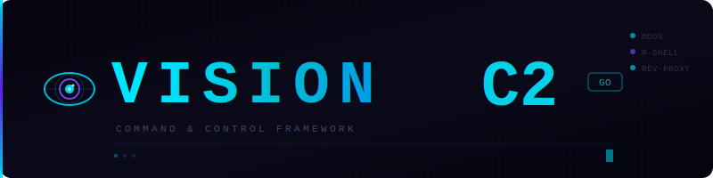

<div align="center">

# VisionC2 

**Advanced, modular C2 framework** focused on evasion, performance, and wide attack protocol coverage. Engineered for mass Unix server remote control and large stress test.



---


[](Docs/ARCHITECTURE.md)

<br>
</div>


## ✨ Key Features

| Category              | Feature                                                                 |
|-----------------------|-------------------------------------------------------------------------|
|  CNC                 | Full-featured interactive TUI control panel (BubbleTea)                             |
|  Communication      | Modern TLS 1.3 encrypted bot ↔ server communication                    |
|  Attack Methods      | Layer 4 (network) & Layer 7 (application) attack methods                |
|  Evasion            | Strong anti-analysis & sandbox evasion (HMAC/MD5 Auth, Proc Scan, Debugger Check)                                |
|  Stealth            | Full Unix daemonization + single-instance enforcement (Mirai Style)                 |
|  Persistent          | Automatic Crontabs, startup Scripts, rexecute downloader on reboot                 |
|  C2 Resilience      | Supports TXT Records, A Records, Direct IP. (No Plaintext/Bot Decrypts C2 at runtime)    |
|  Cross-Platform     | Multi-architecture bot binaries (14 targets out-of-the-box/ Custom UPX Packer included)             |

## ⚔️ Attack Methods

### Layer 4 (Network / Transport Layer)

| Method       | Protocol       | Description                                          |
|--------------|----------------|------------------------------------------------------|
| UDP Flood    | UDP            | High-volume 1024-byte payload spam                   |
| TCP Flood    | TCP            | Connection table exhaustion attack                   |
| SYN Flood    | Raw TCP        | SYN packets with randomized source ports             |
| ACK Flood    | Raw TCP        | ACK packet flooding                                  |
| GRE Flood    | GRE (47)       | GRE protocol packets with maximum payload            |
| DNS Flood    | UDP / DNS      | Randomized DNS query types (A, AAAA, MX, NS, etc.)   |

### Layer 7 (Application Layer)

| Method          | Description                                                  |
|-----------------|--------------------------------------------------------------|
| HTTP Flood      | GET/POST requests with randomized headers & user-agents      |
| HTTPS/TLS Flood | TLS handshake exhaustion + burst of full requests            |
| CF Bypass       | Cloudflare bypass via session/cookie reuse & fingerprinting  |
| Rapid Reset     | HTTP/2 CVE-2023-44487 — batched HEADERS+RST_STREAM framing  |
| Proxy Support   | Full proxy list integration for all L7 methods (HTTP/SOCKS5) |


## 🚀 Installation

### Prerequisites
```bash
# Ubuntu/Debian
sudo apt update && sudo apt install -y \
    upx-ucl openssl git wget gcc python3 screen build-essential
```

### Quick Setup
1. **Clone the repository**
   ```bash
   git clone https://github.com/Syn2Much/VisionC2.git
   cd VisionC2
   chmod +x *
   ```

2. **Run interactive setup**
   ```bash
   python3 setup.py
   ```
   The setup script will:
   - Generate 4096-bit TLS certificates
   - Create encryption keys and configuration
   - Cross-compile binaries for all supported architectures
   - Build the C2 server binary

3. **Output locations**
   - C2 Server: `./server`
   - Agent Binaries: `./bins/`
   - Configuration: `setup_config.txt`

## 🖥️ Usage

### Starting the C2 Server
**Option 1: TUI Mode (Recommended)**
```bash
screen ./server
```
- Detach: `Ctrl + A` → `D`
- Reattach: `screen -r`

**Option 2: Telnet/Multi-User Mode**
```bash
screen ./server --split
nc your-server-ip 1337
```
- User database: `cnc/users.json`
- Default login keyword: `spamtec`

## 🏗️ Architecture

```text
Agent Startup Sequence
──────────────────────
1. Security Checks
   ├─ VM detection
   ├─ Sandbox analysis
   ├─ Debugger detection
   └─ Exit on positive detection

2. C2 Resolution
   ├─ Multi-layer address decryption
   └─ DNS fallback chain (TXT/A records, direct IP)

3. Secure Handshake
   ├─ TLS 1.2+ encrypted connection
   ├─ HMAC authentication
   └─ Registration payload submission

4. Command Loop
   └─ Encrypted bidirectional communication
```

## 📖 Documentation
- **Changelog**: [`Docs/CHANGELOG.md`](Docs/CHANGELOG.md)
- **Commands**: [`Docs/COMMANDS.md`](Docs/COMMANDS.md)
- **Usage**: [`Docs/USAGE.md`](Docs/USAGE.md)

## ⚠️ Legal Disclaimer

**FOR AUTHORIZED SECURITY RESEARCH AND EDUCATIONAL PURPOSES ONLY**

This software is intended for:
- Authorized penetration testing
- Security research and education
- Legitimate stress testing of owned systems

**Usage of this tool for attacking targets without prior mutual consent is illegal. The developer assumes no liability and is not responsible for any misuse or damage caused by this program.**

## 👤 Author

**Syn**
- GitHub: [@syn2much](https://github.com/syn2much)
- Telegram: [@sinackrst](https://t.me/sinackrst)

---

<div align="center">
<sub>Maintained with ❤️ by Syn</sub>
</div>
